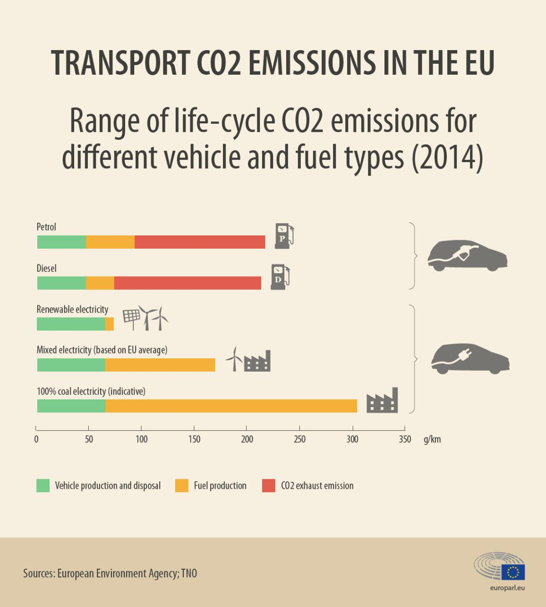
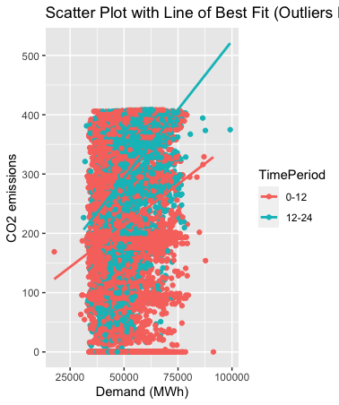

# Electric Grid’s FIRE Summit Presentation
Chirag Jain, Vai Srivastava

## Research Question

What are the marginal emissions for driving an electric car?

<div fig-alt="Emissions from Cars, Gasoline vs Electric Vehicles">

[](https://web.archive.org/web/20201130165117/https://www.europarl.europa.eu/news/en/headlines/priorities/climate-change/20190313STO31218/co2-emissions-from-cars-facts-and-figures-infographics)

</div>

## Data Wrangling

**Outcome variable**

Our outcome variable is the marginal emissions from each power plant
facility in the United States of America. This data is obtained from the
U.S.A. Environmental Protection Agency’s [Clean Air Markets
Division](https://www.epa.gov/power-sector/data-tools).

**Treatment variable**

Our treatment variable is demand at the NERC level. This dataset comes from
the [U.S. Energy Information
Administration](https://www.eia.gov/opendata/). Since our raw demand data is demand at the BA level, we have matched the
balancing authorities with their corresponding NERC regions to aggregate the hourly demand, as shown in
the code below:

``` r
library("tidyverse")
library("terra")
library("simplermarkdown")

# read in csv with all BAs assigned to their corresponding NERC region
nerc_match <- read.csv("respondent-nerc-match.csv")

# filelist contains a list of json that were queried from EIA's OpenData API
for(i in 1:length(filelist)) {
  raw_json <- fromJSON(file = filelist[i])

  # convert json to a dataframe
  eia_json_df <- raw_json$response$data
  eia_df <- as.data.frame(do.call(rbind, eia_json_df))
  eia_df$respondent <- unlist(eia_df$respondent)

  # merge json with nerc regions
  eia_nerc_df <- merge(
    x = eia_df,
    y = nerc_match,
    by = "respondent",
    all.x = TRUE
  )

  # append to output data frame
  eia_nerc_complete <- rbind(eia_nerc_complete, eia_nerc_df)
}

# aggregate eia data by hour and nerc region
nerc_aggregate <- eia_nerc_complete %>%
  group_by(nerc.region, period) %>%
  summarize(demand.mwh = sum(unlist(value)))

nerc_aggregate$period <- unlist(nerc_aggregate$period)
write_csv(nerc_aggregate, "eia_nerc_aggregate.csv")
```

**Control variables**

Our control variables are hour, date, and NERC Region. These variables
are in both the CAMD and EIA datasets, which leads to step one in our
analysis, the merging of data between CAMD and EIA. We do this in the
following code:

``` r
library("arrow")
library("tidyverse")
library("fixest")

state_to_nerc <- read.csv(
  "state_nerc.csv"
)

# set working directory to /DATA/
data_dir <- paste0(
  gdrive_path,
  "/Shared drives/2023 FIRE-SA/FALL OUTPUT/Team EV Electric Grid/DATA/"
)
setwd(data_dir)

fac_to_nerc <- read.csv(
  "facility-attributes.csv"
)

fac_to_nerc <- merge(fac_to_nerc, state_to_nerc, by="State", all.x = TRUE)

fac_to_nerc <- fac_to_nerc %>%
  group_by(Facility.ID, NERC.Region.y) %>%
  tally()

# RFC is ECAR+MAAC+MAIN
# MAPP is MRO
fac_to_nerc <- fac_to_nerc %>%
  mutate(NERC.Region = ifelse(NERC.Region.y == "MAPP", "MRO", NERC.Region.y)) %>%
  mutate(NERC.Region = ifelse((NERC.Region.y == "ECAR")|(NERC.Region.y == "MAAC")|(NERC.Region.y == "MAIN"), "RFC", NERC.Region.y)) %>%
  mutate(NERC.Region.y = NULL)

nercagg <- read.csv("eia_nerc_aggregate.csv")

clean_camd <- function(data, fi) {
  data_df <- data %>%
    dplyr::select(Date, Hour, Facility.ID, SO2.Mass..lbs., State) %>%
    dplyr::filter(Facility.ID == fid[fi]) %>%
    mutate(SO2.Mass..lbs.=ifelse(!is.na(SO2.Mass..lbs.), SO2.Mass..lbs., 0))%>%
    group_by(Date, Hour, State) %>%
    summarize(SO2 = sum(SO2.Mass..lbs.))

  return(data_df)
}

state_code <- c("de", "al", "az", "ar", "ca", "co", "ct", "dc", "de", "fl", "ga", "id", "il", "in", "ia", "ks", "ky", "la", "me", "md", "ma", "mi", "mn", "ms", "mo", "mt-west", "mt-east", "ne", "nv", "nh", "nj", "nm", "ny", "nc", "nd", "oh", "ok", "or", "pa", "ri", "sc", "sd", "tn", "tx-west", "tx-east", "ut", "vt", "va", "wa", "wv", "wi", "wy")

# loop starts here for one state and one facility at a time
max <- length(state_code)
for (st in 1:max) {
  d20 <- read_csv_arrow(paste0("CAMD-STATE/2020/emissions-hourly-2020-", state_code[st], ".csv"))
  d21 <- read_csv_arrow(paste0("CAMD-STATE/2021/emissions-hourly-2021-", state_code[st], ".csv"))
  d22 <- read_csv_arrow(paste0("CAMD-STATE/2022/emissions-hourly-2022-", state_code[st], ".csv"))
    
  fid <- unique(d20$Facility.ID)
  test <- data.frame(matrix(
    ncol = 3,
    nrow = 0
  ))
  for (fi in 1:length(fid)) {
    nerc <- fac_to_nerc %>%
      filter(Facility.ID == fid[fi])
    df2 <- data.frame(matrix(
      ncol = 5,
      nrow = 0
    ))
    if (!(nerc$NERC.Region == ""))
    {
      df20 <- clean_camd(d20, fi)
      df21 <- clean_camd(d21, fi)
      df22 <- clean_camd(d22, fi)
      
      df <- rbind(df20, df21, df22)
      df$period <- paste0(df$Date, "T", str_pad(df$Hour, 2, pad = "0"))
      df$Date <- NULL
      df$Hour <- NULL
      
      lnerc <- nercagg %>%
        filter(nerc.region == nerc$NERC.Region)
      
      df2 <- merge(lnerc, df, by = "period", all = TRUE)
      df2 <- df2 %>%
        mutate(SO2 = ifelse(is.na(df2$SO2), 0, df2$SO2))
    }
    
    ## Regression follows...
  }
}
```

An example of `df2` (which holds the values for CAMD emissions matched
with EIA demand) from Deleware plant \#592 is shown below:

``` r
df2_example <- read.csv("df2 example - DE plant 592.csv")
head(df2_example)
```

             period nerc.region demand.mwh SO2
    1 2020-01-01T00         RFC     192056   0
    2 2020-01-01T01         RFC     186730   0
    3 2020-01-01T02         RFC     181146   0
    4 2020-01-01T03         RFC     175814   0
    5 2020-01-01T04         RFC     170452   0
    6 2020-01-01T05         RFC     167068   0

``` r
summary(df2_example)
```

        period          nerc.region          demand.mwh             SO2          
     Length:26304       Length:26304       Min.   :6.590e+04   Min.   : 0.00000  
     Class :character   Class :character   1st Qu.:1.576e+05   1st Qu.: 0.00000  
     Mode  :character   Mode  :character   Median :1.754e+05   Median : 0.00000  
                                           Mean   :3.366e+05   Mean   : 0.00776  
                                           3rd Qu.:1.988e+05   3rd Qu.: 0.00000  
                                           Max.   :2.148e+09   Max.   :50.22100  

## Preliminary Results

Display a figure showing how the treatment variable impacted the outcome
variable.

This graph demonstrates the impact of Demand (MWh) on CO2 emissions
(Kilo tons) during the two halves of each day from 2020-2022 in California.

Analysis: Ultimately, the graph demonstrates that as the demand
increases, the CO2 emissions increase as well. The time period from
12-24 experiences more CO2 emissions and 0-12 experiences relatively
less emissions as demonstrated by the slope of each line. The time
period from 12-24 hours has more emissions per MegaWatt hour than 0-12
hours primarily because that is when the EVs are charged.
